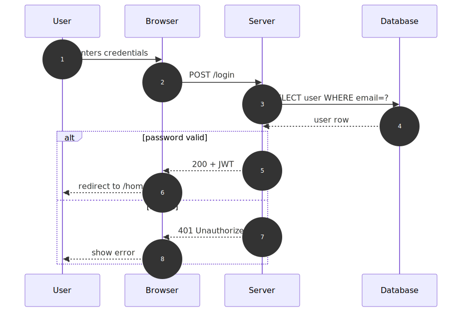

# Diagrams WITH Mermaid Skills

Same three diagrams, but applying mermaid best practices: correct diagram type,
explicit direction, proper arrow syntax, quoted labels, subgraphs for grouping,
class styling, and the right diagram for the right job.

## 1. Login Flow — `flowchart` with decision branch

## 2. System Architecture — `flowchart` with subgraphs

## 3. Sequence — correct diagram type

## 4. Bonus — state machine (skill = knowing it exists)

